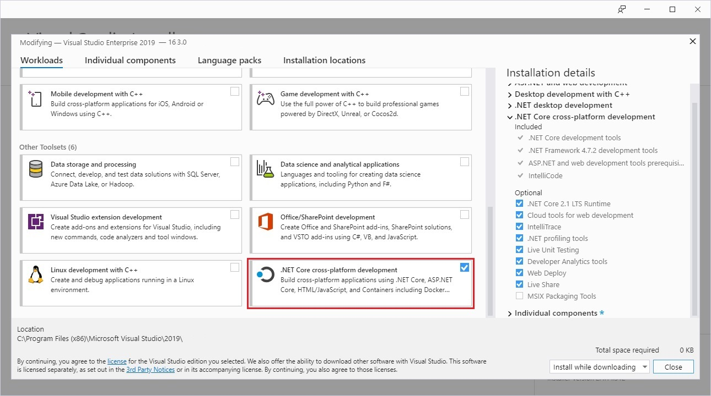
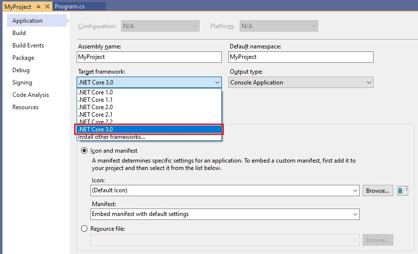

# Prerequisites for .NET Core on Windows

This article shows the supported OS versions in order to run .NET Core applications on Windows. The supported OS versions and dependencies that follow apply to the three ways of developing .NET Core apps on Windows:

* [Command line](./tutorials/using-with-xplat-cli.md)
* [Visual Studio](https://www.visualstudio.com/downloads/?utm_medium=microsoft&utm_source=docs.microsoft.com&utm_campaign=button+cta&utm_content=download+vs2019)
* [Visual Studio Code](https://code.visualstudio.com/)

Also, if you're developing on Windows using Visual Studio, the [Prerequisites to develop .NET Core apps with Visual Studio](#prerequisites-to-develop-net-core-apps-with-visual-studio) section goes in more detail about minimum versions supported for .NET Core development.

## .NET Core supported operating systems

The following articles have a complete list of .NET Core supported operating systems per version:

* [.NET Core 3.0](https://github.com/dotnet/core/blob/master/release-notes/3.0/3.0-supported-os.md)
* [.NET Core 2.2](https://github.com/dotnet/core/blob/master/release-notes/2.2/2.2-supported-os.md)
* [.NET Core 2.1](https://github.com/dotnet/core/blob/master/release-notes/2.1/2.1-supported-os.md)
* [.NET Core 1.0](https://github.com/dotnet/core/blob/master/release-notes/1.0/1.0-supported-os.md)

For download links and more information, see [.NET downloads](https://dotnet.microsoft.com/download) to download the latest version or [.NET downloads archive](https://dotnet.microsoft.com/download/archives#dotnet-core) for older versions.

## .NET Core dependencies

.NET Core 1.1 and earlier versions require the Visual C++ Redistributable when running on Windows versions earlier than Windows 10 and Windows Server 2016. This dependency is automatically installed by the .NET Core installer.

[Microsoft Visual C++ 2015 Redistributable Update 3](https://www.microsoft.com/download/details.aspx?id=52685) must be manually installed when:

* Installing .NET Core with the [installer script](./tools/dotnet-install-script.md).
* Deploying a self-contained .NET Core application.
* Building the product from source.
* Installing .NET Core via a *.zip* file. This can include build/CI/CD servers.

> [!NOTE]
> **For Windows 8.1 and earlier versions, or Windows Server 2012 R2 and earlier versions:**
>
> Make sure that your Windows installation is up-to-date and includes [KB2999226](https://support.microsoft.com/help/2999226/update-for-universal-c-runtime-in-windows), which can be installed through Windows Update. If you don't have this update installed, you'll see an error like the following when you launch a .NET Core application: `The program can't start because api-ms-win-crt-runtime-l1-1-0.dll is missing from your computer. Try reinstalling the program to fix this problem.`
>
> **For Windows 7 or Windows Server 2008 R2:**
>
> In addition to KB2999226, make sure you also have [KB2533623](https://support.microsoft.com/help/2533623/microsoft-security-advisory-insecure-library-loading-could-allow-remot) installed. If you don't have this update installed, you'll see an error similar to the following when you launch a .NET Core application: `The library hostfxr.dll was found, but loading it from C:\<path_to_app>\hostfxr.dll failed`.

## Prerequisites to develop .NET Core apps with Visual Studio
    
You can use any editor to develop .NET Core applications using the .NET Core SDK. Visual Studio 2017 and later versions provide an integrated development environment for .NET Core apps on Windows.

Each .NET Core version has a minimum version of Visual Studio required. To verify your Visual Studio version:

* On the **Help** menu, choose **About Microsoft Visual Studio**.
* In the **About Microsoft Visual Studio** dialog, verify the version number.

The following table lists the minimum version for each SDK:

| .NET Core SDK version | Visual Studio version                      |
| --------------------- | ------------------------------------------ |
| 3.0                   | Visual Studio 2019 version 16.3 or higher. |
| 2.2                   | Visual Studio 2017 version 15.9 or higher. |
| 2.1                   | Visual Studio 2017 version 15.7 or higher. |
| 1.x                   | Visual Studio 2017 version 15.0 or higher. |

<!-- markdownlint-disable MD025 -->

# [.NET Core 3.0](#tab/netcore30)

To develop .NET Core apps in Visual Studio 2019 using the .NET Core 3.0 SDK:

* [Download and install Visual Studio 2019 version 16.3 or higher](/visualstudio/install/install-visual-studio) and select one of the following workloads that includes the .NET Core SDK, depending on the kind of application you're building:

  * The **.NET Core cross-platform development** workload in the **Other Toolsets** section.
  * The **ASP.NET and web development** workload in the **Web & Cloud** section.
  * The **NET desktop development** workload in the **Windows** section.

The following image shows the **.NET Core cross-platform development** workload selected in the Visual Studio UI:

Visual Studio 2019 16.3 uses .NET Core 3.0 SDK by default after any of these workloads are installed.

If you want your existing projects to use the latest .NET Core runtime, retarget existing .NET Core projects to .NET Core 3.0 using the following instructions:

* On the **Project** menu, choose **Properties**.
* In the **Target framework** selection menu, set the value to **.NET Core 3.0**.

Once you have Visual Studio configured with .NET Core 3.0 SDK, you can do the following actions:

* Open, build, and run existing .NET Core 1.x and 2.x projects.
* Retarget .NET Core 1.x and 2.x projects to .NET Core 3.0, build, and run.
* Create new .NET Core 3.0 projects.

# [.NET Core 2.x](#tab/netcore2x)

To develop .NET Core apps in Visual Studio 2017 using the .NET Core 2.2 SDK:

* [Download and install Visual Studio 2017 version 15.9.0 or higher](/visualstudio/install/install-visual-studio) with the **.NET Core cross-platform development** workload (in the **Other Toolsets** section) selected.

After the **.NET Core cross-platform development** toolset is installed, Visual Studio usually installs a previous version of the .NET Core SDK.
For example, Visual Studio 2017 15.9 uses .NET Core 2.1 SDK by default after the workload is installed.

To update Visual Studio to use .NET Core 2.2 SDK:

 1. Install the [.NET Core 2.2 SDK](https://dotnet.microsoft.com/download).

 1. If you want your project to use the latest .NET Core runtime, retarget existing or new .NET Core projects to .NET Core 2.2 using the following instructions:

    * On the **Project** menu, choose **Properties**.
    * In the **Target framework** selection menu, set the value to **.NET Core 2.2**.

Once you have Visual Studio configured with .NET Core 2.2 SDK, you can do the following actions:

* Open, build, and run existing .NET Core 1.x and 2.x projects.
* Retarget .NET Core 1.x and 2.x projects to .NET Core 2.2, build, and run.
* Create new .NET Core 2.2 projects.

# [.NET Core 1.x](#tab/netcore1x)

To develop .NET Core 1.x apps in Visual Studio, [download and install Visual Studio 2017](/visualstudio/install/install-visual-studio) with the **".NET Core cross-platform development"** workload (in the **Other Toolsets** section) selected.

> [!IMPORTANT]
> It's possible to use Visual Studio 2015 for .NET Core 1.x development, but it's not recommended for the following reasons:
>
> * The .NET Core tooling is a preview version, which is not supported.
> * The projects are project.json-based, which is deprecated.
>
> For more information about the project format changes, see [High-level overview of changes](./tools/cli-msbuild-architecture.md).

---
